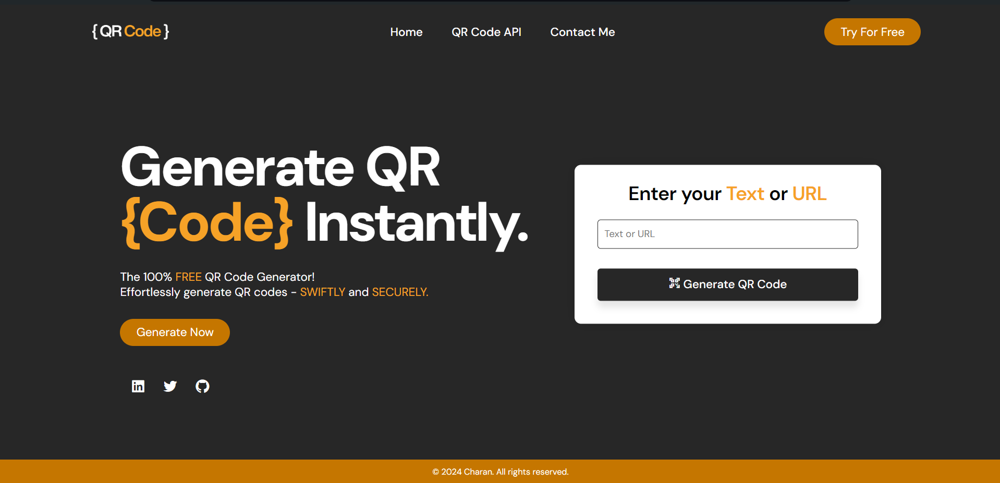

# QR Code Generator

A simple and free QR code generator built using **HTML, CSS and JavaScript** - By [CHARAN](http://github.com/charan-s108)



## Features
- Generate QR code from __TEXT__ or __URL__.
- Download generated QR codes.
- Minimalistic Landing Page design.
- High performance API server
- Encrypted communication via HTTPS (SSL/TLS).

## API Reference

| Domain     | API              |
| :--------- | :--------------- |
| `GoQR`     | api.qrserver.com |


| Command               | Description                |
| :-------------------- | :------------------------- |
| `create-qr-code`      | Create / generate QR Codes |
| `read-qr-code`        | Read / Scan QR Codes       |

#### Making API Calls

To generate a QR code using the GoQR API, you can call the following endpoint: https://api.qrserver.com/v1/create-qr-code/?size=150x150&data= + qrtext.value;


Replace `qrtext.value` with the content you want to encode into the QR code. 

For example, to create a QR code with the text "example", you would call: https://api.qrserver.com/v1/create-qr-code/?size=150x150&data=example

You can find detailed documentation and examples on the [official GoQR API documentation](https://goqr.me/api/).

#### JavaScript Function Example

Here's a JavaScript function that utilizes the GoQR API to generate a QR code based on user input:

```javascript
function GenerateQR() {
    if (qrtext.value.length > 0) { // Check if input text is not empty

        // Generate QR code image using QR Server API
        qrimage.src = "https://api.qrserver.com/v1/create-qr-code/?size=150x150&data=" + qrtext.value;

        // Show the container with the QR image
        displaybox.classList.add("show-img");

        // Update download link href to the generated QR code image
        downloadButton.href = qrimage.src;
        downloadButton.style.display = "block"; // Show the download button
    } else {
        // If input text is empty, add error class to input field for visual feedback
        qrtext.classList.add("error");

        // Remove error class after 1 second to remove visual feedback
        setTimeout(() => {
            qrtext.classList.remove("error");
        }, 1000);
    }
}
```

## License

[MIT](https://github.com/charan-s108/qr-code-generator/blob/main/LICENSE)
